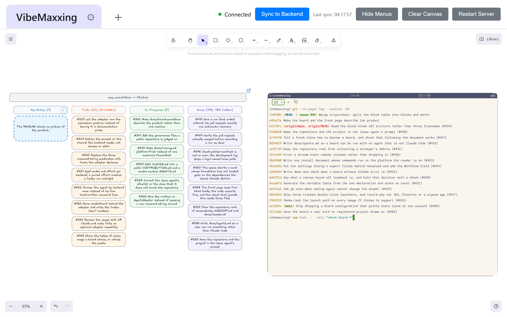

# VibeMaxxing

[](LICENSE)

A live [Excalidraw](https://excalidraw.com) canvas your coding agent draws on — and, on top of
it, a workbench for running a software project on that canvas: blocks that open GitHub issues,
your GitHub project mirrored beside them, implementations that each get a git worktree of their
own, and real shells.



## Installation

Node ≥ 20 is the only prerequisite. Any one of these three lines is a working start:

```bash
npx -y @vitorengers/vibemaxxing                                    # the board, opened in your browser
npx -y @vitorengers/vibemaxxing install-skill --dir <skills-root>  # the drawing skill, into your agent
claude mcp add vibemaxxing -- npx -y @vitorengers/vibemaxxing      # or reach it over MCP
```

[docs/install.md](docs/install.md) is the same ground at length — every command spelled for
Windows, macOS and Linux, the double-click launchers, and the from-source path (`npm ci`,
`npm run build`) a contributor wants. [docs/mcp-server.md](docs/mcp-server.md) has the tool
catalogue and a configuration block for each MCP client.

> If you had this server configured as `excalidraw`, the key is what a client turns into tool
> ids, so `mcp__excalidraw__*` becomes `mcp__vibemaxxing__*` — update any `--allowedTools`
> pattern with it, or the agent is refused and exits 0 with nothing to say why
> ([docs/trap-allowed-tools.md](docs/trap-allowed-tools.md)).

## Your first five minutes

1. **Bring the board up.** The first line above starts the canvas server, opens a tab and
   prints where it is. A fresh clone comes up on a blank canvas, and that is not a broken
   build: the board on screen belongs to nobody until a registry names a project.
2. **Register the clone as its own project.**
   [The first run](docs/running.md#the-first-run-register-the-clone-as-its-own-project) is three
   steps. A registry JSON lists your projects — `EXCALIDRAW_WORKSPACES` names it — and each
   project describes its own board in a `board.config.json` at its root: its docs directory, its
   shape library, its GitHub repository and project, its per-agent model and effort. Tabs along
   the top switch between them ([docs/workspaces.md](docs/workspaces.md)).
3. **Press `Alt+P`, then `Alt+G`.** This repository's own board is cut into two marked sections
   and each declares its own key: **Project structure** (`Alt+P`) is what the tool is,
   **Development** (`Alt+G`) is how it got that way. The keys are not constants in the frontend —
   a section is a shape that carries its own title and hotkey
   ([docs/board-sections.md](docs/board-sections.md)).
4. **Write an observation into the issue block and press "Create issue".** An agent researches
   the repository, opens the issue with `gh`, and the URL lands back on the block. From the
   mirror's Todo column you can then have it implemented.

## The blocks on the canvas

A shape's `customData.kind` decides what it is; a `docKey` instead makes it a documentation card
that opens the matching markdown in a panel ([docs/docs-block.md](docs/docs-block.md)).

**Blocks** — a shape that does something:

| `customData.kind` | What it is |
|---|---|
| `issue` | Write an observation into the shape; an agent investigates the repository, opens the issue, and the URL lands back on the block — [docs/issue-block.md](docs/issue-block.md) |
| `project-board` | Your GitHub project, mirrored on the canvas and redrawn from GitHub on every read, with two-way moves and a queue that implements issues — [docs/project-board.md](docs/project-board.md) |
| `terminal` | Real shells on the canvas, as tabs — [docs/terminal.md](docs/terminal.md) |

**Marks** — a shape drawn *around* part of the board, which does nothing but say where a key
lands:

| `customData.kind` | What it is |
|---|---|
| `board-section` | A half of the board, carrying the key that reaches it — [docs/board-sections.md](docs/board-sections.md) |
| `board-subsection` | A part of a section, with no key of its own: `Alt+Left` and `Alt+Right` step between the parts of the half being read — [docs/board-sections.md](docs/board-sections.md) |

An implementation started from the board is given a git worktree of its own before the agent is
spawned: `<project>-worktrees/issue-<n>`, on a branch of the same name, cut from the default
branch. Several run at once, and each opens and merges its own pull request — which is why the
convention exists rather than a shared checkout.

The workbench half reads **github.com and only github.com**: there is no host setting, and a
GitHub Enterprise Server or a GitLab is out of scope. The canvas itself requires none of it.

## Choose your agent

Which coding agent does that work is a command line you supply, not a vendor this tool picks.
[docs/agents.md](docs/agents.md) has a Claude Code recipe and a Codex CLI recipe side by side,
what each flag buys, and the rules that hold whatever the binary is — it must run
non-interactively, it must be permitted to run `gh` and `git`, and it must print the pull request
URL last.

## Where it runs

| Platform | Canvas and CLI | Issue blocks, mirror, implementations | Terminal blocks |
|---|---|---|---|
| **Windows** | yes | yes | yes — a real console host |
| **Windows + WSL** | yes | yes — a project may declare a WSL environment and its agents run inside the distribution | yes |
| **macOS** | yes | yes | yes |
| **Linux** | yes | yes | yes |

Node ≥ 20 everywhere; `git` and `gh` are needed only by the workbench half. There is no
container path — it was deleted rather than half-supported
([#300](https://github.com/vitorengers/vibemaxxing/issues/300)): the image bound every interface
on a server whose API has no authentication, and carried neither `gh` nor `git`, so most of what
this tool is could not have run inside it.

**Security note:** the canvas server binds `127.0.0.1` only by default, and the GitHub half is
bound to that — off loopback every GitHub-backed route answers `403`, so what you get on a
network interface is a drawing canvas and nothing else, and the board says so on itself rather
than showing you an empty region. Everything under `/api` is behind a secret the server writes
to your state directory at startup and the launcher hands to your browser; you never type it,
and nothing that cannot read that file can drive the board. If you expose it on a network
interface (`HOST=0.0.0.0`) anyway, put network-level access controls in front: that secret is
one shared token, not a login.
**[docs/SECURITY.md](docs/SECURITY.md) is the whole of it** — what the tool runs as, which
switches spawn a coding agent or a real shell and what each one grants, the origin gate in front
of every route, and where to report a vulnerability.

## Testing

The tests are `scripts/check-*.mjs`: one per behaviour that has ever broken, each a plain Node
script with no test framework, each starting whatever server it needs on a port the kernel just
handed it.

```bash
npm run build     # the checks load dist/, and the runner refuses to start without it
npm test          # every check
```

`npm test` is `node scripts/run-checks.mjs`, which takes `--only`, `--skip`, `--tier`, `--list`
and `--jobs`. Every check declares a tier — `fast`, `browser`, `windows`, `wsl` or `repo` —
saying what it needs beyond Node and a built `dist/`, and one whose tool this machine has not got
is reported as a skip rather than passing quietly.
[docs/running.md](docs/running.md) has the tier table and how to run a single check by hand.

## Everything else

[docs/index.md](docs/index.md) indexes every document. The ones a first-time reader wants:

- [docs/cli.md](docs/cli.md) — every command, the conventions, the exit codes
- [docs/mcp-server.md](docs/mcp-server.md) — the MCP tools, and a config block per client
- [docs/rest-api.md](docs/rest-api.md) — the HTTP surface the board itself is built on, and the
  only workspace-aware one
- [docs/running.md](docs/running.md) — the operator and development procedure, and a table of
  every `EXCALIDRAW_*` variable with its default, generated from `src/core/settings.ts`
- [docs/faq.md](docs/faq.md) — how this differs from the official Excalidraw MCP, whether the
  agent can really see what it drew, what to do when something does not come up
- [CONTRIBUTING.md](CONTRIBUTING.md) — how work is done in this repository, with
  [AGENTS.md](AGENTS.md) as the copy a coding agent loads, and
  [docs/development-log.md](docs/development-log.md), one dated entry per merged pull request
- [docs/SECURITY.md](docs/SECURITY.md) — the trust model of a tool that spawns coding agents and
  real shells: what it runs as, which switches grant that, and where to report a vulnerability.
  [CODE_OF_CONDUCT.md](CODE_OF_CONDUCT.md) is what is expected of everyone taking part

Core drawing runs fully local and needs no API key. The optional `share` command uploads an
encrypted scene to excalidraw.com; nothing else leaves the machine except the calls to
github.com the workbench half makes on your behalf.

## Demo


*This is the upstream project's demo and not this fork's — `demo.gif` and the video are
upstream's work, kept because they still show what the canvas does ([NOTICE.md](NOTICE.md)).
[Watch the upstream demo video](https://youtu.be/ufW78Amq5qA).*

## Licence and attribution

[MIT](LICENSE). This is a fork of the upstream project `yctimlin/mcp_excalidraw`, whose copyright
is upstream's; it carries the same licence and is not affiliated with the Excalidraw team.
[Excalidraw](https://github.com/excalidraw/excalidraw) is its own MIT-licensed project, and this
one builds on it.

Bug reports and pull requests belong on
[this repository's issue tracker](https://github.com/vitorengers/vibemaxxing/issues) — the
repository is `vitorengers/vibemaxxing` — and on the GitHub project the maintainer's board is
pointed at, which is configured per checkout rather than shipped, so a clone of this repository
is nobody else's project board.
